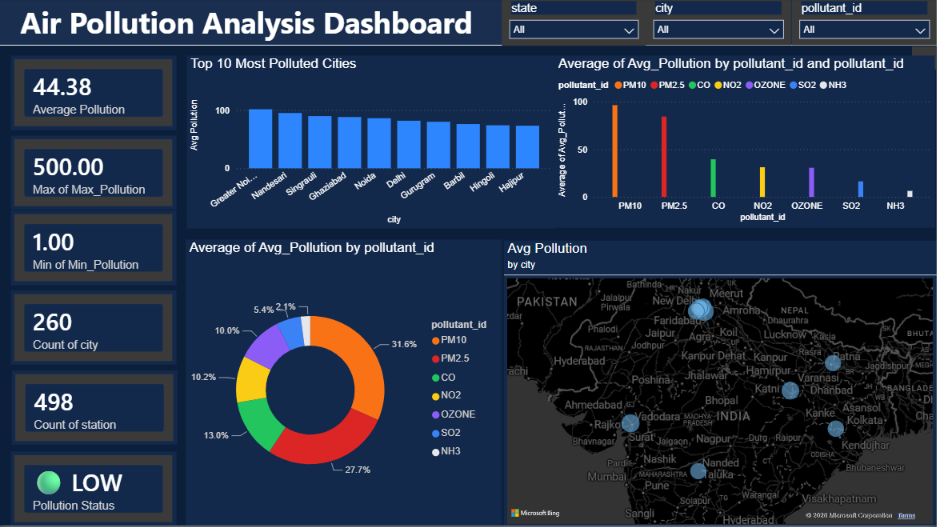

# Air Pollution Analysis Dashboard

Interactive dashboard for analyzing air pollution levels across cities and pollutants, providing insights into average and maximum pollution levels, pollutant-wise distribution, city-wise rankings, and geographical pollution patterns.

## Dashboard Preview

## Key Insights

- Identifies the top 10 most polluted cities based on average pollution levels.
- Compares average pollution across different pollutants such as PM10, PM2.5, CO, NO2, OZONE, SO2, and NH3.
- Provides city-wise geographical visualization of pollution levels.
- Displays key metrics including average, maximum, and minimum pollution levels.

## Technologies Used

- Power BI
- Data Visualization
- Data Analysis
